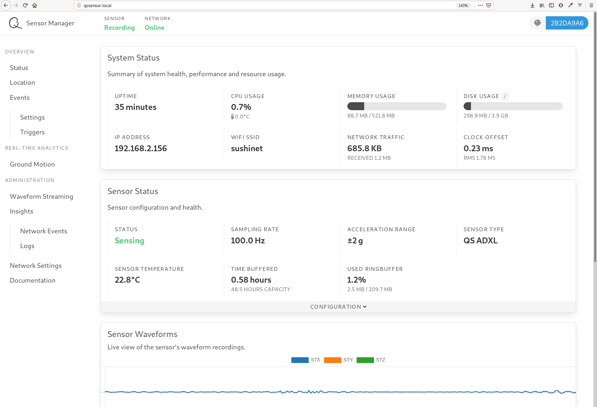
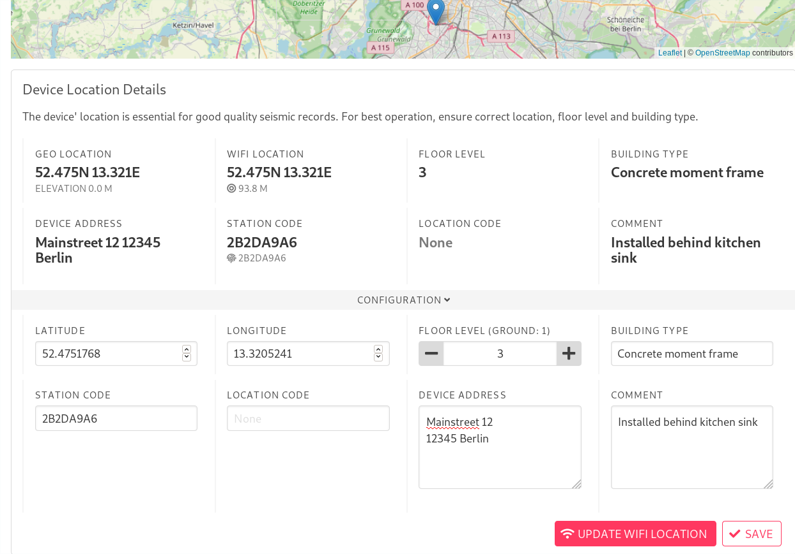

# Sensor Configuration

## System Overview

The local device configuration can be accessed from a device in the same local area network using a web browser. Open the url [http://qssensor.local](http://qssensor.local).

::: warning Your browser can't find http://qssensor.local?
Your device will be accessible using a computer at [http://qssensor.local](http://qssensor.local) only if your router allows [mDNS broadcasting](https://en.wikipedia.org/wiki/Multicast_DNS). If mDNS broadcasting is disabled, you need to log into your router or use a tool such as [nmap](https://nmap.org/) to find the local IP address of your sensor.
:::

You should now see the local sensor configuration page providing you with a basic system overview.

::: tip
Each configurable panel has a `CONFIGURATION` bar. You can click that bar to unfold a configuration menu.
:::

## Location settings

Open the *Location* tab.

The sensor can set a first estimated location based on nearby Wi-Fi ssids. Unfold the `CONFIGURATION` menu and click the `UPDATE WIFI LOCATION` button. Fine tune the location either by dragging and dropping the location pin on the map or by setting the exact location in the menu. Additional meta information such as address, floor level and building type will be helpful for later data analysis. You can also find the `STATION CODE` in this panel which can be used to e.g. retrieve waveform data from your device.

## Connect to the Backend

Go to `Network Settings` and open the `CONFIGURATION` panel. Paste your personal [QuakeSaver TOKEN](../setup/#quakesavertoken) into the designated field and click on `SAVE`. Your sensor will now be assigned to your personal sensor collection.  

## Event Triggers

Find the `Events` menu, open the `Triggers` settings and unfold the `CONFIGURATION` menu. Set a threshold when your device should trigger and run its analysis plugins.

You can enable, disable and configure those plugins under `Settings`. 

## System Reboot

If you want to reboot your sensor open the `INSIGHTS` panel and hit the `REBOOT` button.
