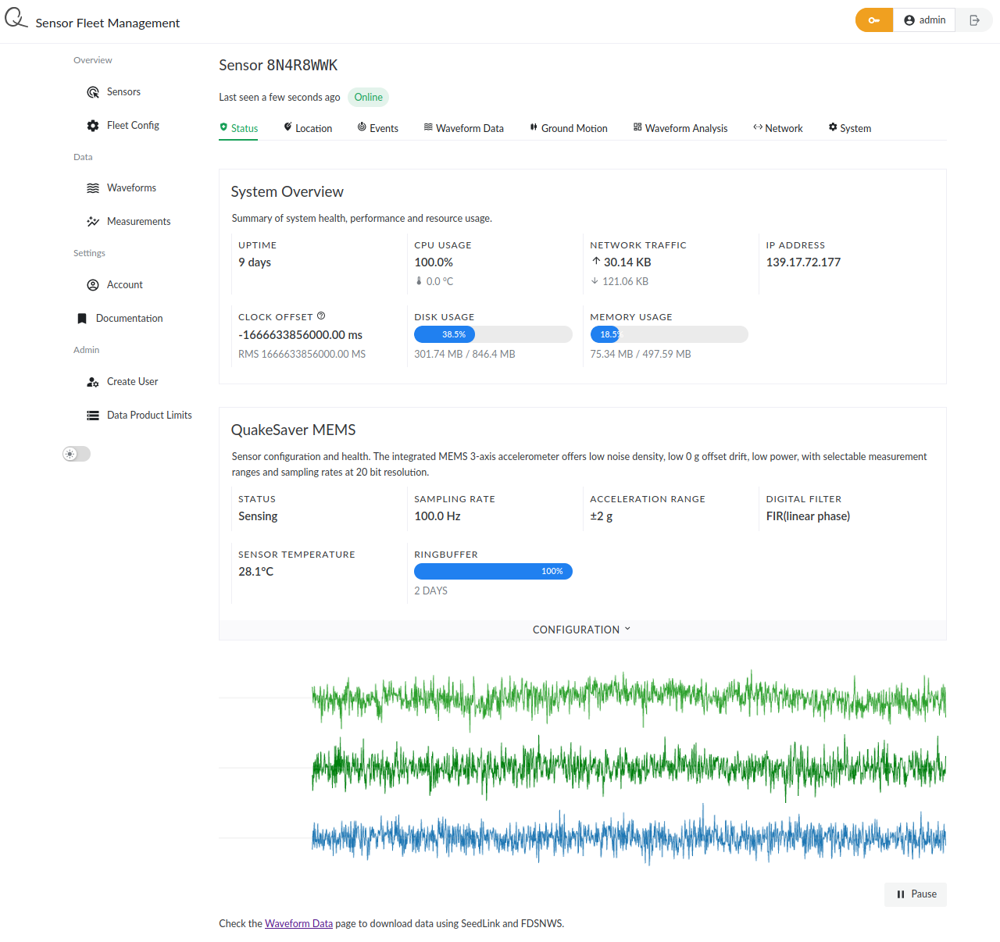

# Server Configuration

Go to your QuakeSaver server url ([dev.quakesaver.net](https://dev.quakesaver.net)). Use the credentials you were provided with to login.

::: warning You don't have login details?
Send us an email to <info@quakesaver.net>.
:::

## Overview

You will find a list and map of all your devices on your start page and under _All Sensors_. Either click on the triangles representing sensors or on _Details_ in the sensor table to find out more about each of your QuakeSavers.

## Sensor Details



The horizontally aligned tabs _Status_, _Location_, _Events_, etc. show identical data to your local sensor settings page you saw before. You can configure your sensor, accordingly.

## Waveform Download

### SeedLink

Each QuakeSaver sensor comes with a [SeedLink server](http://ds.iris.edu/ds/nodes/dmc/services/seedlink/) on board. You can stream your sensors' waveform data using this protocol in near real-time.

You need to enable the sensor's SeedLink server. Go to the _Waveform Streaming_ tab of your sensor's details view and enable the SeedLink server from the _CONFIGURATION_ menu.

After enabling seed link you will be able to access your device data e.g. using the [ObsPy SeedLink client](https://docs.obspy.org/packages/autogen/obspy.clients.seedlink.easyseedlink.create_client.html#obspy.clients.seedlink.easyseedlink.create_client).

::: tip Upcoming Feature
Your device needs to be directly accessible e.g. by providing the client with a static IP address? We will release on-board Wireguard VPN functionality soon! Stay tuned :star2:
:::

### FDSN Webservice

For easy and highly efficient data aggregation of all your sensors' data use the FDSN Web Services.

::: details Example using ObsPy
```python
#!/bin/env python3
from obspy import UTCDateTime
from obspy.clients.fdsn import Client

client = Client('https://dev.quakesaver.net')

m = 60.  # seconds
tmax = UTCDateTime.now()
tmin = tmax - 5*m

st = client.get_waveforms("*", "*", "*", "*", tmin, tmax)
st.write('/tmp/quakesaver-sensors.mseed')
st.plot()
```
:::

## Virtual Networks

You can group your sensors into networks where each sensor can be a member of several networks. Go to _Networks > Create New Network_. Assign a _Network Name_ and _Network Code_ and click _Create Network_. To assign sensors to your newly created virtual network go to the _Manager Network_ tab and find the sensor you want to add in the _Add Sensor to Network_ menu.
