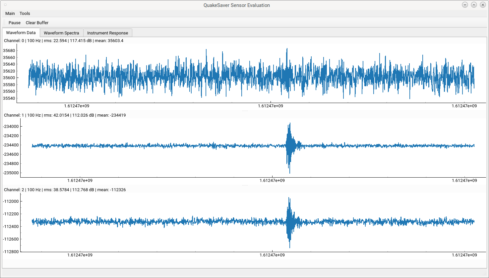

---
tags:
  - evaluation
  - testing
  - development
  - open-source
  - open source
  - gui
  - zeromq
---

# Development

SeismiQ GmbH is a spin-off from the [German Research Centre for Geoscience GFZ Potsdam](https://gfz.de). We develop our sensors in tight cooperation with research scientists at the GFZ and other European and Asian research institutions. We are strong evangelists of [FOSS](https://en.wikipedia.org/wiki/Free_and_open-source_software), that's why we want open software for a thriving ecosystem around SeismiQ sensors.

## Software

SeismiQ software is open-sources and distributed under [GPLv3](https://www.gnu.org/licenses/gpl-3.0.en.html). Open `git` repositories will be available soon! :cloud:

## Continuous Integration and Delivery Testing

Every line of code that is added to the sensor software stack triggers a rebuild of the embedded Linux to include the latest software updates. The newly built image is then automatically deployed to samples of each of our sensor types and generations. When a sensor receives its image it will test itself against the new software and report back to out integration pipelines.

This extensive and complex deployment validation allows delivering continuously validated software.

## Sensor Insights

All devices broadcast data and status locally on a [ZeroMQ](https://zeromq.org/) TCP port. Our open-source testing and evaluation software will be available here.

Figure: Evaluation GUI for SeismiQ instruments. Available as open-source software.
