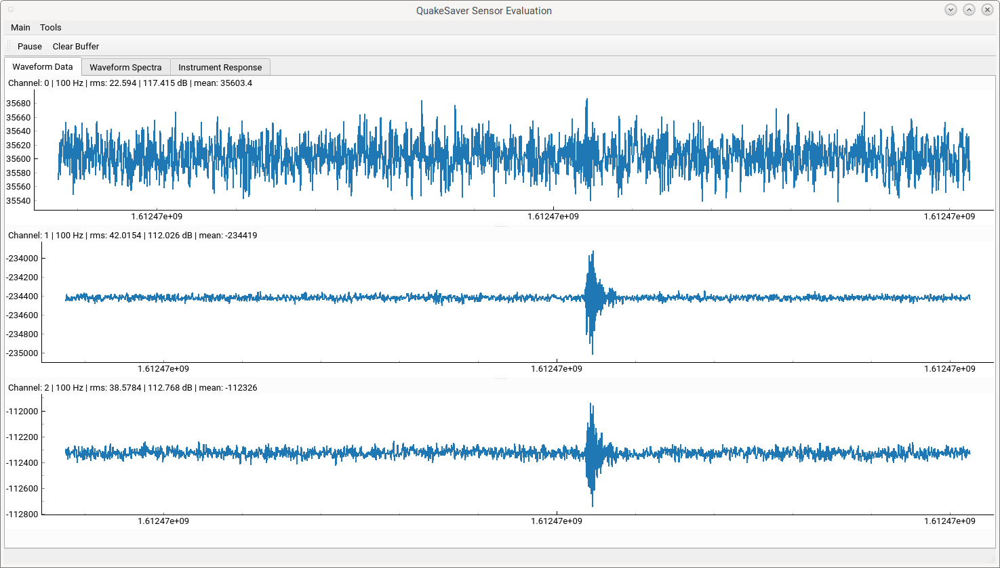

---
tags:
  - evaluation
  - testing
  - development
  - open-source
  - open source
  - gui
  - zeromq
---

# Development

SeismiQ GmbH is a spin-off from the [German Research Centre for Geoscience GFZ Potsdam](https://gfz.de) — one of the world's leading geoscience institutions. Our sensors are developed in close collaboration with research scientists at the GFZ and partner institutions across Europe and Asia. This scientific foundation ensures that every SeismiQ instrument meets the data quality standards demanded by professional seismology.

We are committed to [open-source software](https://en.wikipedia.org/wiki/Free_and_open-source_software) to foster a thriving ecosystem around SeismiQ sensors.

## Software

SeismiQ sensor software is open-source and distributed under [GPLv3](https://www.gnu.org/licenses/gpl-3.0.en.html).

## Continuous Integration and Delivery

Every code change to the sensor software stack triggers an automated rebuild of the embedded Linux image. The new image is deployed to physical samples of each sensor type and generation — the sensor runs its full self-test suite and reports results back to our CI pipeline before any release is approved.

This hardware-in-the-loop validation guarantees that software updates are tested on real instruments before they reach your deployment, delivering continuously validated, production-ready firmware.

## Sensor Insights

All devices broadcast data and status locally over a [ZeroMQ](https://zeromq.org/) TCP port, enabling seamless integration with custom monitoring tools and third-party workflows. An open-source evaluation GUI is available for local sensor inspection and testing.

Figure: Evaluation GUI for SeismiQ instruments. Available as open-source software.
