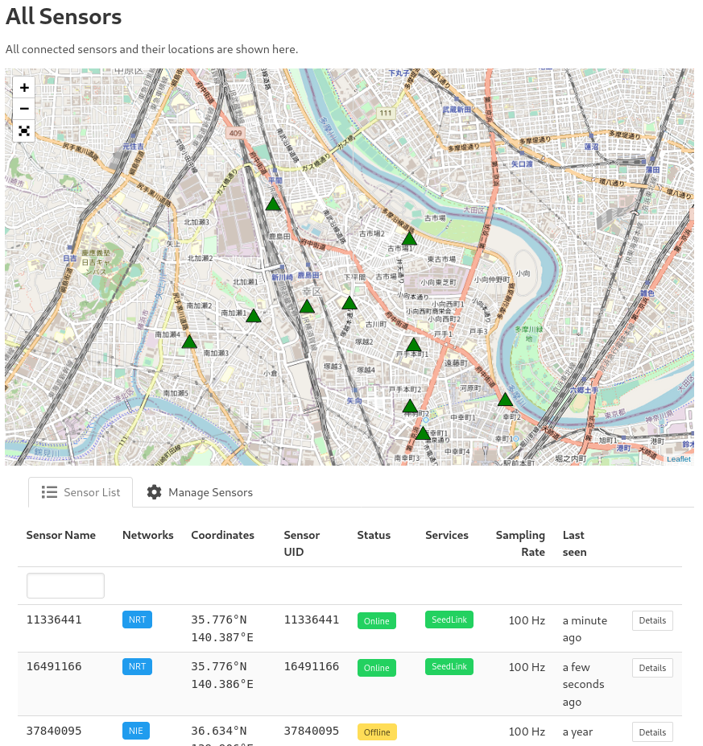

# Network Management

Manage your **fleet of SeismiQ sensors** from a single, browser-based interface — accessible from any device, anywhere. Group sensors into virtual networks and apply configuration changes **in bulk or individually**, without on-site visits.

The **digital twin** of each sensor maintains a live reflection of all operational parameters and continuously computed data products such as network-aggregated PGA. Data is visualized as interactive maps and lists, and exported as [GeoJSON](https://geojson.org/) for direct integration into any GIS platform or operational dashboard.

This gives operators a continuous, real-time overview of network health, data quality, and ground motion activity — critical for geothermal operations, infrastructure monitoring programs, and national seismic networks managing hundreds of instruments.

Figure: SeismiQ sensor network in the Tokyo Metropolitan Area — a subset of a large-N MEMS deployment.

::: tip Contact Sales
Managing a large network or evaluating SeismiQ for an infrastructure or geothermal project? [Get in touch](https://seismiq.net/contact) to discuss your use case.
:::
