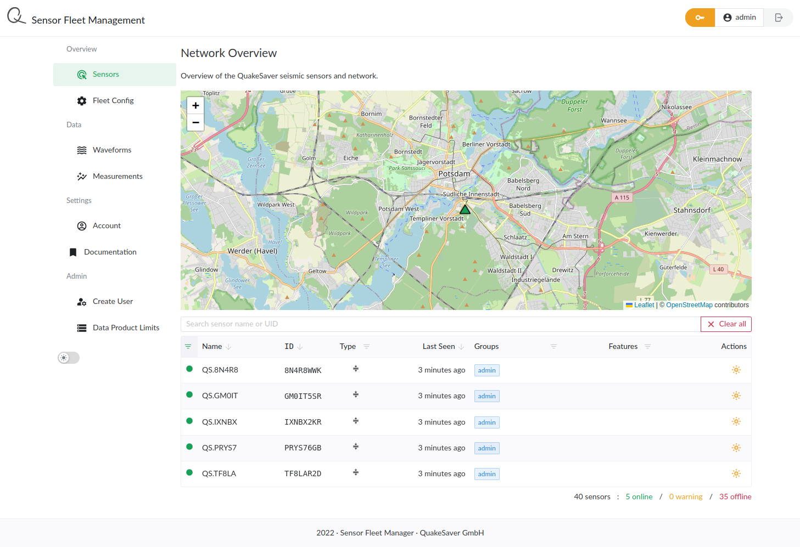

# Network Management

Manage your **fleet of QuakeSaver sensors** with our modern and reliable backbone. Intuitive and powerful user interface are accessible from any device and in any browser. Group your sensors into virtual networks and **configure the sensors bulk or individually**.

The **digital twin** of each sensor provides a detailed reflection of all parameters and continuous data analysis such as network aggregated PGA. Data products are graphically presented as maps, list and accessible as descriptive [GeoJSON](https://geojson.org/) for seamless integration in any GIS software. This enables a continuous overview and health monitoring of your entire network within a glimpse.

Figure: QuakeSaver network in Tokyo Metropolitan Area. A subset from a fleet of low-res MEMS sensors.
