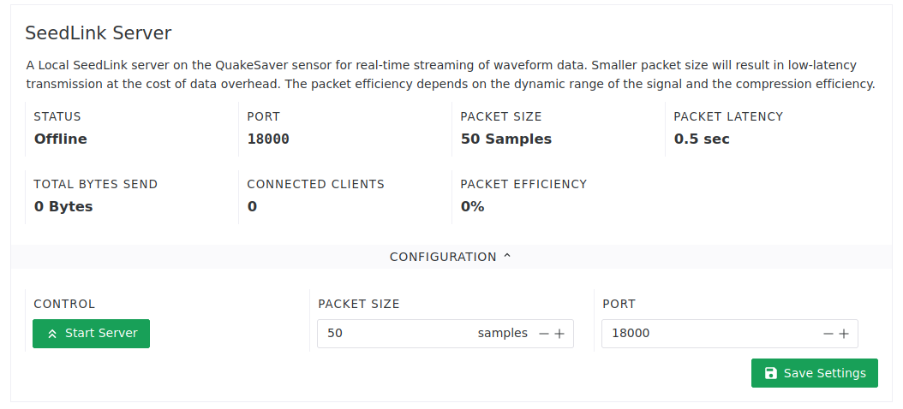

---
tags:
  - seedlink
  - miniseed
  - streaming
  - latency
---
# SeedLink Servers

SeedLink is one of the most used streaming protocols for seismic time series data. SeedLink is implemented on the sensors and on the central platform, which provides data access to the whole network.
Our implementation of SeedLink v3 is compatible with all SeedLink implementations: [slinktool](https://ds.iris.edu/ds/nodes/dmc/software/downloads/slinktool/), [ObsPy](https://docs.obspy.org/), [Pyrocko](https://pyrocko.org). Hence, different management software are supported, such as [SeisComp3](https://www.gempa.de/), [SeisGram2k](http://alomax.free.fr/seisgram/SeisGram2K.html).

By default the sensors are configured for **low-latency delivery** of the streamed MiniSeed packages, in optimal conditions the delay is very close to latency of the digital filter path.
For higher packet efficiency (higher latency) SeedLink **Packet Size** can be configured from the `SeedLink Server` configuration panel of each sensor.

```
QS_EE461__EN1, 50 samples, 100 Hz, 2021,035,15:15:13.755500 (latency ~0.202 sec)
QS_EE461__EN2, 50 samples, 100 Hz, 2021,035,15:15:13.755500 (latency ~0.202 sec)
QS_EE461__EN3, 50 samples, 100 Hz, 2021,035,15:15:13.755500 (latency ~0.206 sec)
```

## Network SeedLink Server

The network's SeedLink server can be accessed through the central server. Waveform data is then streamed through the MQTT channels and delivered over SeedLink in real-time. This has the advantage that no VPN connection to the sensor is required to channel the data.

Go to *Waveforms > Network SeedLink Server* panel for more information. Or connect directly to the SeedLink server:

```sh
slinktool -L  seedlink.network.quakesaver.net:18000
```

## Sensor SeedLink Server

QuakeSaver sensors provide a built-in SeedLink server for single- and multi-station mode. To start the server, open the sensor's web interface and navigate to *Waveform access > SeedLink Server* and start the server.


Use the `slinktool` to check connection to the sensor's SeedLink server:

```sh
slinktool -p qssensor.local:18000 -o /tmp/test.mseed
```
