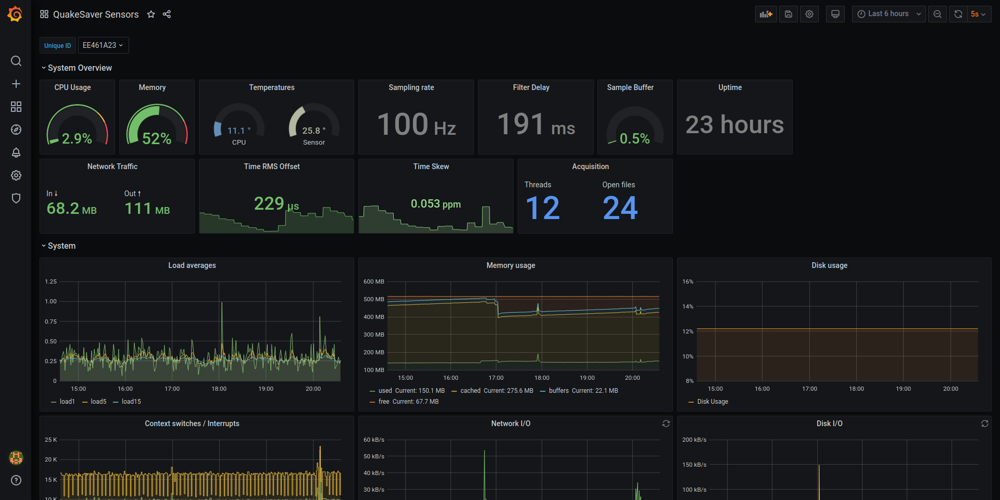

# Sensor Monitoring

We monitor your sensor network, so you can focus on the job. Our sensors transmit a multitude of environment, sensor and system parameters, continuously and in real-time, for **predictive maintenance**.
All metrics are stored in [InfluxDB](https://influxdata.com), an open-source time series database. InfluxDB handles the retention, extraction of metrics and can ingest millions of data points.

The sensor's health can be monitored using [Grafana](https://grafana.org), an open-source analytics and visualization platform. This enables the configuration of thresholds and **active alarms**.

Find our Grafana dashboard template [here](https://grafana.com/grafana/dashboards/13814).

## System

The basic system metrics reflecting the software state of health include:

 * CPU
 * Memory usage
 * Network traffic
 * File system metrics
 * and many more...

## Timing Quality
Time synchronization is critical for seismic instruments, therefore we constantly monitor the quality of the time synchronization. These parameters include:

* Time offset & RMS
* Clock drift
* and many more...

## Environment <Badge text="HiDRA only" type="tip"/>

The sensor's environment is critical to the operational reliability of the instrument. Therefore, QuakeSaver HiDRA sensors are measuring the enclosure's environment:

* barometric pressure sensor
* relative humidity
* enclosure temperature

This enabled awareness about resulting condensation water for environmental influence.

## Power Supply <Badge text="HiDRA only" type="tip"/>

Remote deployments often rely on solar panels, fuel cells or batteries as power supply which can be unreliable. QuakeSaver sensors monitor the supply voltage as well as the power consumption to inform about the power supply conditions.

* Supply voltage
* Power consumption

## Seismic metrics

All sensors can report PGA, JMA Shindo and spectral intensity continuously. These seismic parameter are calculated from a defined window (usually 30 s) before they are sent to a central server. Read more about real-time processing [here](../real-time-analytics/index.md).
