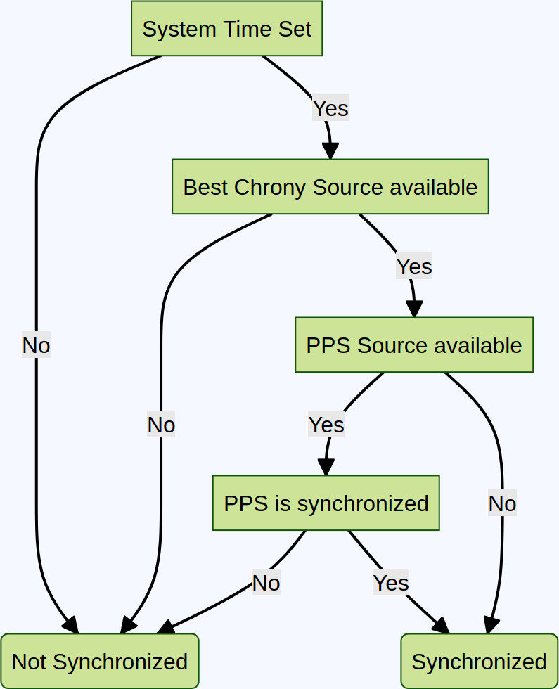

# Timing and Synchronization

Time synchronization of the instrument is crucial to ensure the quality of the seismic data stream. Our sensors offer a redundant
system using a combination of low-latency NTP and external GPS time stamping.

Furthermore, QuakeSaver sensors determine the intrinsic clock drift of the system in correlation with the ambient temperature to constantly
correct skew and correct the system's clock. The system will learn the clock drift and provide more accurate timestamps the longer the system is deployed.

## Network Time Protocol (NTP)

The network time protocol (NTP) and its implementation has evolved over the years to provide precisions less than a millisecond.
We leverage these modern implementations (i.e. chrony) together with continuous quality control to ensure reliable time stamping over the seismic network.

## GNSS <Badge text="HiDRA only" type="tip"/>

An external GPS receiver can be used for time stamping. Using precise PPS interrupts this solution guarantees precise clock synchronization in
connected and off-line environments.

## Time Synchronisation Decision Tree

To decide whether the system is synchronized through NTP or PPS (GPS Receiver) we aanalyse the time sources of the sytem
<!-- Mermaid Flowchart
---
title: Time Sync Decision
---
flowchart TD
    ValidTime[System Time Set]

    BestSource[Best Chrony Source available]
    HasPPS[PPS Source available]
    PPSsynced[PPS is synchronized]
    %% HasRTC[RTC available]

    No(Not Synchronized)
    Yes(Synchronized)

    ValidTime -->|No| No
    ValidTime -->|Yes| BestSource
    BestSource -->|No| No
    BestSource -->|Yes| HasPPS
    HasPPS -->|Yes| PPSsynced
    HasPPS -->|No| Yes
    PPSsynced -->|No| No
    PPSsynced -->|Yes| Yes
-->

## Status LEDS

The instruments communicate their status through LEDs.

### QS MEMS

The QuakeSaver MEMS has a single RGB LED for status reporting. The startup sequence flashes red, green, blue and signals the startup of the acquisition software.

| Signal         | Status                                                |
|----------------|-------------------------------------------------------|
| Green flash    | Time is synchronized.                                 |
| Blue flash     | Time is synchronized, sensor is connected to network. |
| Red fast flash | System Error                                          |

### QS HiDRA

The QuakeSaver HiDRA has three LEDs for status reporting. The startup sequence cycles the LEDs nad signals the startup of the acquisition software.

| Signal                   | Status                                              |
|--------------------------|-----------------------------------------------------|
| Power on                 | System is powered and acquisition software running. |
| Acquisition flash        | System is acquiring data                            |
| Sync/Online first flash  | Time is synchronized.                               |
| Sync/Online second flash | Time is synchronized and system is online           |

The first and single flash refers to synchronizity with the acquistion flash.
