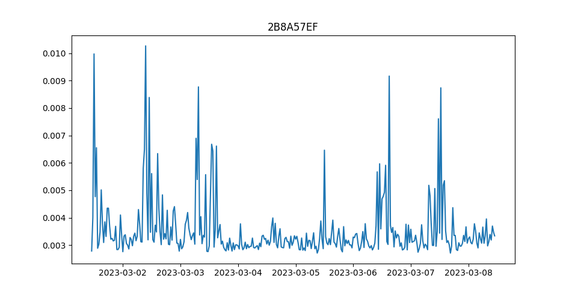

Python Client
=============

Our open-source [quakesaver-client](https://github.com/QuakeSaver/quakesaver-client) allows easy access to **all data** of your entire sensor fleet.
You can query what sensors you have in your database and download the **raw waveform** data as well as the **metadata** straight from the sensor.

The higher level dataproducts such as *Spectral Intensity*, *JMA Intensity*, *Peak Acceleration/Velocity* data and many more can be access with only few lines of python code.
Queries for these also allow applying rolling `mean`, `max`, `min` aggregators with a configurable window length.

::: tip
Checkout the **[documentation](https://quakesaver.github.io/quakesaver-client/index.html)** for further info.
:::

## Example

This example downloads 5 hours of *Peak Horizontal Acceleration* data with a rolling *max* of 30 minutes.

::: tip
This also works with the **demo user** login. If you don't have one, let us know. 
:::

```python
from datetime import datetime, timedelta
from quakesaver_client import QSClient
from quakesaver_client.models.measurement import MeasurementQuery
import matplotlib.pyplot as plt


# Use your standard login credentials from network.quakesaver.net
client = QSClient(email="USERNAME", password="SUPERSECRETPASSWORD")

# A list of sensor IDs that I have access to
ids = client.get_sensor_ids()

# Get the digital twin of the first sensor in the list
sensor = client.get_sensor(ids[0])

# Setup a time window e.g. of the last 7 days
end_time = datetime.utcnow()
start_time = end_time - timedelta(days=7)

# Create a query with the time range and a rolling max of 30 minutes
query = MeasurementQuery(
    start_time=start_time,
    end_time=end_time,
    interval=timedelta(minutes=30),
    aggregator="max",
)
result = sensor.get_peak_horizontal_acceleration(query)

plt.plot(result.data.times, result.data.values)
plt.title(result.sensor_uid)
plt.show()
```

