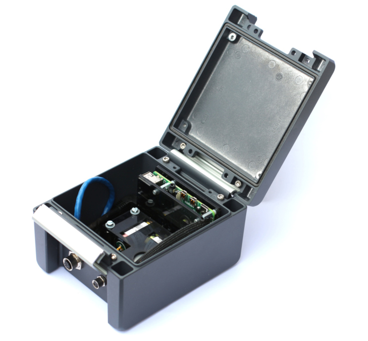
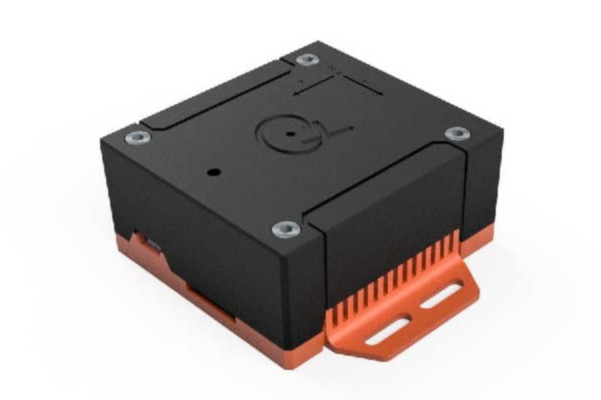

# Sensors

SeismiQ offers two complementary sensor platforms to match any deployment scenario — from high-precision research installations to large-N urban monitoring networks.

## SeismiQ HiDRA

The 6-component High Dynamic Range (HiDRA) sensor combines **highly sensitive short-period coil** transducers with a high-resolution strong-motion MEMS accelerometer in a single DIN-certified, IP67-rated instrument. Purpose-built for professional monitoring where data quality and regulatory compliance are non-negotiable.

**Best for:** Geothermal operations, induced seismicity monitoring, national seismic networks, structural health monitoring, research deployments.

[→ See full specifications](qs-hidra.md)

Figure: SeismiQ HiDRA 3-component short-period seismic sensor with optional 3-component strong-motion accelerometer in IP67/69 enclosure.

## SeismiQ MEMS

A cost-effective 3-axis MEMS accelerometer designed for **mass deployment of connected seismic sensor networks**. High noise performance and broad frequency bandwidth make it an ideal choice for urban seismic monitoring, aftershock campaigns, and structural health monitoring at scale.

**Best for:** Dense urban networks, large-N research campaigns, infrastructure monitoring, early warning systems.

[→ See full specifications](qs-mems.md)

Figure: SeismiQ MEMS accelerometer for strong-motion seismic monitoring.
