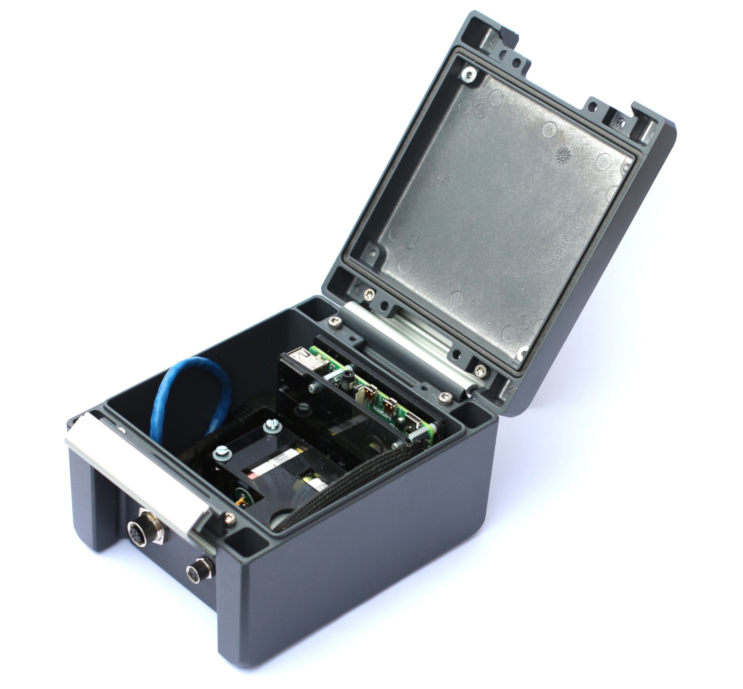
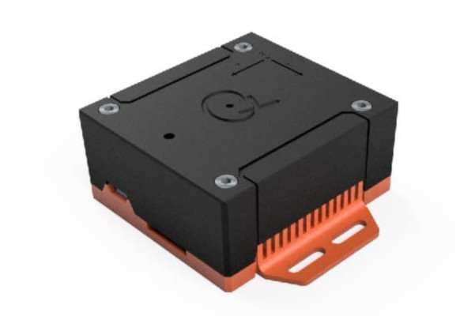
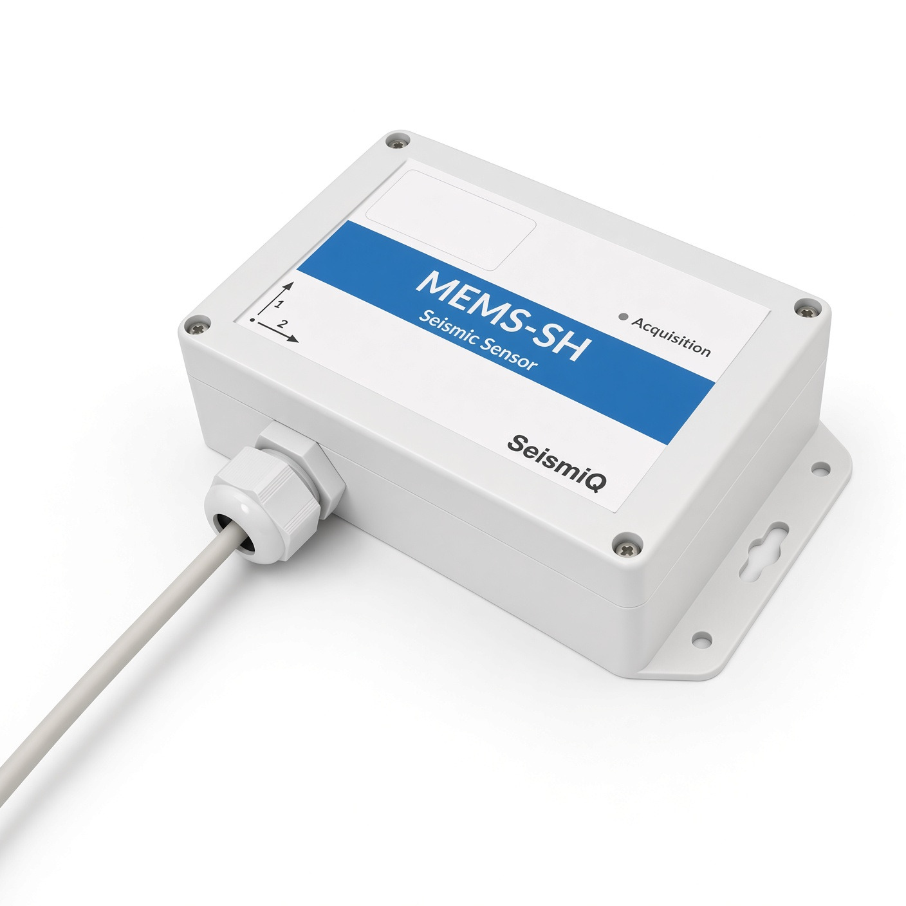

# Sensors

SeismiQ offers three complementary sensor platforms to match deployment scenarios ranging from high-precision research installations to large-N urban and structural monitoring networks.

## SeismiQ HiDRA

The 6-component High Dynamic Range (HiDRA) sensor combines **highly sensitive short-period coil** transducers with a high-resolution strong-motion MEMS accelerometer in a single DIN-certified, IP67-rated instrument. Purpose-built for professional monitoring where data quality and regulatory compliance are non-negotiable.

**Best for:** Geothermal operations, induced seismicity monitoring, national seismic networks, structural health monitoring, research deployments.

[→ See full specifications](qs-hidra.md)

Figure: SeismiQ HiDRA 3-component short-period seismic sensor with optional 3-component strong-motion accelerometer in IP67/69 enclosure.

## SeismiQ MEMS

A cost-effective 3-axis MEMS accelerometer designed for **mass deployment of connected seismic sensor networks**. High noise performance and broad frequency bandwidth make it an ideal choice for urban seismic monitoring, aftershock campaigns, and structural health monitoring at scale.

**Best for:** Dense urban networks, large-N research campaigns, infrastructure monitoring, early warning systems.

[→ See full specifications](qs-mems.md)

Figure: SeismiQ MEMS accelerometer for strong-motion seismic monitoring.

## SeismiQ MEMS-SH

The MEMS-SH combines the 3-axis, 20-bit MEMS sensing platform with an **IP68 structural enclosure** and PoE or direct DC power. It is designed for permanent vibration and strong-motion monitoring where sensors are mounted on structures or installed in exposed positions.

**Best for:** Structural health monitoring, continuous vibration monitoring, strong-motion recording, and exposed PoE-connected installations.

[→ See full specifications](qs-mems-sh.md)

Figure: SeismiQ MEMS-SH accelerometer for structural vibration and strong-motion monitoring.
