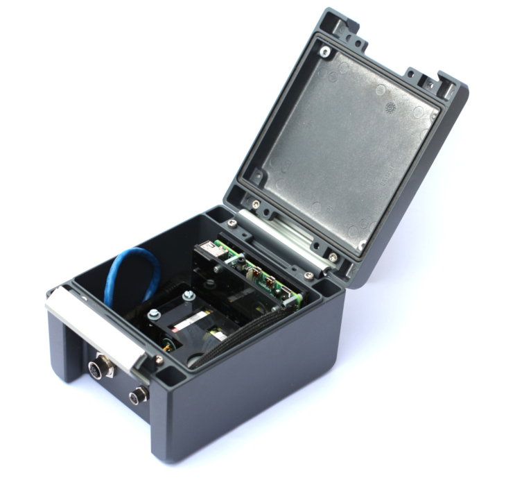

# Sensors

## QuakeSaver HiDRA

The 6-component High Dynamic Range (HiDRA) sensor is a **cost-effective seismometer** which combines the characteristics of **highly sensitive short-period coil** transducers with the reliable performance of a high-resolution strong-motion MEMS accelerometer.

[→ See all features](qs-hidra.md)

Figure: QuakeSaver HiDRA 3-component short-period seismic sensor, and 3-component strong motion accelerometer (_optional_) in an IP67/69 enclosure (stock image is outdated :snail:).

## QuakeSaver MEMS

New generations of MEMS accelerometers enable **mass deployment of connected seismic sensor networks**at low cost. The excellent noise performance and frequency bandwidth of our 3-axis MEMS technology is suited for seismic and structural health monitoring.

[→ See all features](qs-mems.md)

Figure: QuakeSaver MEMS accelerometer for strong motion seismic monitoring in an indoor case.
