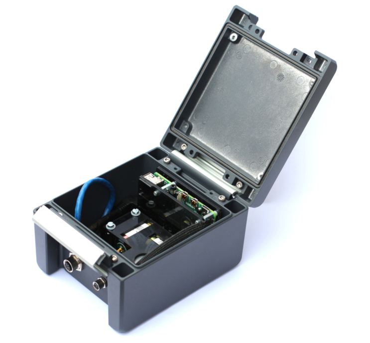
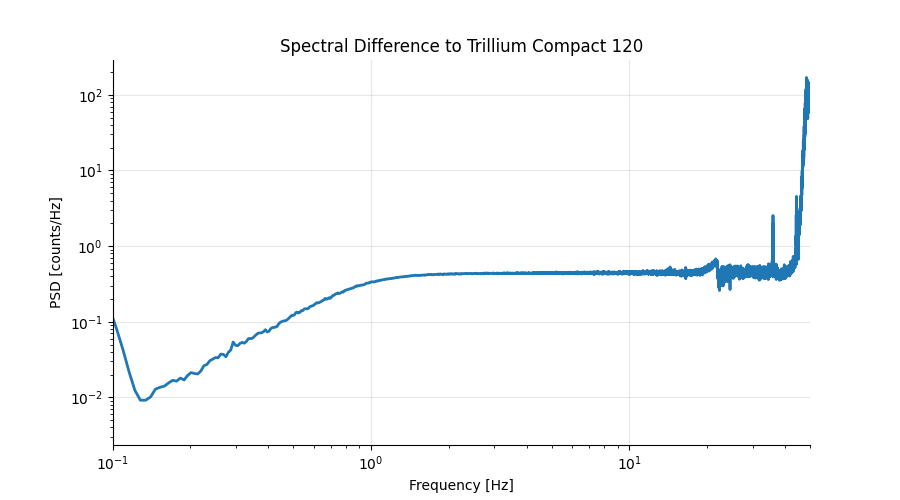
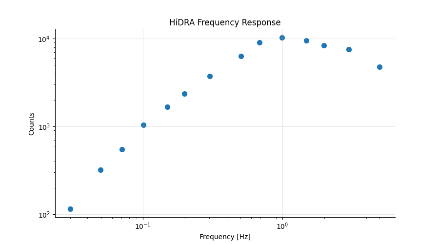
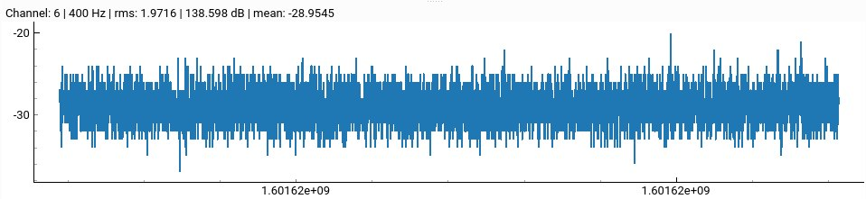
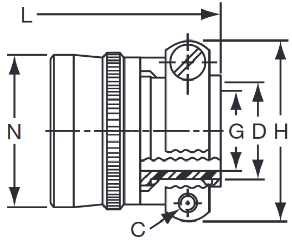

---
tags:
  - coil
  - low noise
---

# QuakeSaver HiDRA

The 6-component High Dynamic Range (HiDRA) sensor is a **cost-effective seismometer** which combines the characteristics of highly sensitive short-period coil transducers with the reliable performance of a high-resolution strong-motion MEMS accelerometer. This enables short-period measurements together with strong-motion accelerations. Further the instrument can determine its the absolute orientation.
The adjustable pre-amplification and sampling rate make the HiDRA sensor suitable for **monitoring local, regional and teleseismic events or continuous structural health monitoring**.

::: tip Quick Facts

* 3-component short-period seismometer with lower cutoff frequency **f~c~ of 0.5 Hz and speed proportional characteristic**.
* Ultra-low noise 24-bit ADC (RMS \~2 counts; 139 dB) with variable sampling rate of **50 Hz, 100 Hz and 200 Hz** and analog **pre-amplification 1x, 2x and 4x**.
* Low noise 3-component 20-bit MEMS accelerometer with variable sampling rate from 50 Hz, 100 Hz and 200 Hz and configurable range of 2 g and 4 g (*optional*).
* [Time synchronization](../features/timing.md) via external GNSS antenna :satellite: or NTP.
* Industrial **NAND memory** ensures high system reliability.
* Connected over 100 MBit Ethernet.
* Flexible **power supply from 9 to 18 V**. Power and voltage are monitored.
* Hygrometer, barometer (atmospheric pressure) and thermometer for continuous system and instrument monitoring.

:::

Figure: QuakeSaver HiDRA 3-component short-period seismic sensor, and 3-component strong motion accelerometer in an IP67/69 enclosure (the stock image is outdated :snail:).

## Resolution and Sensitivity

The HiDRA is using high-quality geophones which are actively dampened by our analog front-end. The ultra-low noise analog front-end is followed by a 24 bit ultra-low noise analog-digital-converter (ADC).
This combination ensures a stable analog signal path for a system **sensitivity of 0.35 counts/nm/s**.

Figure: Spectral difference between 0.1 Hz to 50 Hz to a [Trillium](https://www.nanometrics.ca) Compact 120 broadband seismometer sampled by a [Digos](https://digos.eu/) DATA-CUBE.

## Response Function

The response function of the HiDRA is centered at 2 seconds for both the vertical and horizontal components.

Figure: Empirical frequency response of the HiDRA short-period sensor with a natural corner frequency f~c~ of 0.5 Hz.

::: tip Meta-data Management
All configurable settings (sampling rate and analog gain) are reflected instantly in the meta-data management, compliant to [StationXML](https://www.fdsn.org/xml/station/).
:::

## Sampling Rate

The sampling rate of the system can be configured to 50 Hz, 100 Hz and 200 Hz. All channels are sampled at the same frequency. The sampling frequency can be configured adjusted on-site or remotely.

For all sampling rates different FIR filters are configurable.

::: warning Future Upgrade
:construction: Sampling rates of up to 400 Hz are in development.
:::

## Dynamic Range

The HiDRA features an ultra-low noise analog frontend components and 24-bit analog-digital-converter (ADC), resulting in a self noise of as low as \~2 counts RMS. This leads to an **effective dynamic of 139 dB**.

Figure: Self-noise of \~2 counts RMS of the analog digital converter for the 3C short-period HiDRA instrument.

## Calibration

Every sensor is calibrated against against a well known high-class broadband seismometer. The calibration values are stored permanently on the instrument an included in the associated response.

## Connectivity

The HiDRA sensor is connected over 100 MBit fast **Ethernet**. If no connection is available the sensor will archive seismic data on the durable NAND data store.

## Power Supply and Consumption

The HiDRA can be powered by a **9 - 18 V DC** power supply, the average power consumption of the instrument is **\~3.8 Watts**. This allows off-grid deployments using solar panels, batteries or fuel cells without the need for DCDC converters. The consumption can increase when [real-time signal processing](../real-time-analytics/) chains are calculated on the device, such as more demanding data products like continuous PPSDs.

The power supply and the instrument's consumptions are [continuously monitored](../features/system-monitoring.md#power) by the device. This ensures that alarms are triggered timely to operators to take actions and ensure operation of the sensor.

## IP67 Enclosure

The high-quality aluminum housing protects the sensor from moisture and guarantees durability as well as high reliability. The adjustable tripod and Amphenol (MIL-DTL-26482) bayonet connector allow an uncomplicated setup and commissioning of the sensor even under harsh environmental conditions.

* Resistant aluminum housing for permanent outdoor use with IP67 standard.
* Dimensions are 130x160x85 mm (DLH), weight 1.5 kg.

## Operational Temperature

Electrical parts and connectors are selected from industry rated components which provide a stable operation from -20° to 85° C.
In freezing cold temperatures the HiDRA can use its computing core to stabilize the inside temperature of the enclosure and the sensitive seismic sensors.

## DIN Certification

Certification of the HiDRA seismometer for [DIN 4150](https://www.geothermie.de/bibliothek/lexikon-der-geothermie/d/din-4150.html) and DIN 45669 is currently pursued. Existing units will be upgraded to hold the certificate.

We hope to be back with good news in Q2 2020 :rocket:.
