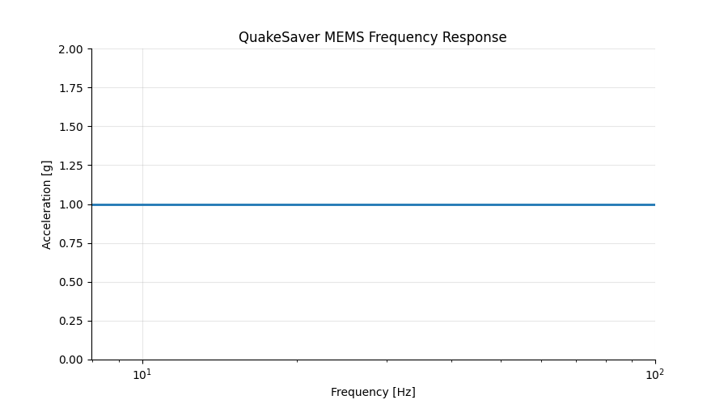

---
tags:
  - mems
  - cheap
  - 20 bit
---
# QuakeSaver MEMS

New generations of MEMS accelerometers **enable mass deployment of connected seismic sensor networks** at low cost. The excellent noise performance and frequency bandwidth of our 3-axis MEMS technology is suited for strong motion sensing and and structural health monitoring.

The small form factor is suited for indoor- and off-grid outdoor deployment.

::: tip Quick Facts

* **Low noise 3-component 20-bit MEMS** accelerometer with variable sampling rate from 50 Hz, 100 Hz and 200 Hz and configurable range of 2 g and 4 g.
* Quick and easy setup through smart phone.
* **WiFi and Ethernet** connected.
* Industrial **NAND memory** ensures high system reliability.
* Power is supplied **5V over USB**, the consumption is \~1 Watt.

:::

Figure: QuakeSaver MEMS accelerometer for strong motion seismic monitoring in an indoor case.

## Dynamic and Range

The QuakeSaver MEMS features a 3-components MEMS accelerometer with **20-bit dynamic and self-noise of 22 μg/&#8730;Hz**. The absolute range can be configured between 2 g and 4 g.

## Frequency Response

The MEMS instrument has a flat frequency response static offset 0 Hz (1 g) to 100 Hz.

Figure: Flat frequency response of the high-resolution QuakeSaver MEMS accelerometer.

## Sampling Rate

The sampling rate is configurable to **50 Hz, 100 Hz, 200 Hz, 250 Hz and 500 Hz**.

## Power Supply and Consumption

The sensor is powered by **5 V micro USB** and consumes \~1 Watt power. This makes temporary deployment through portable battery packs and power banks feasible.

## Enclosure

The sensor is housed in a durable ABS plastic casing, which is suited for indoor use.

* Dimensions are 50x30x20 mm (DLH), weight \~150 g.
