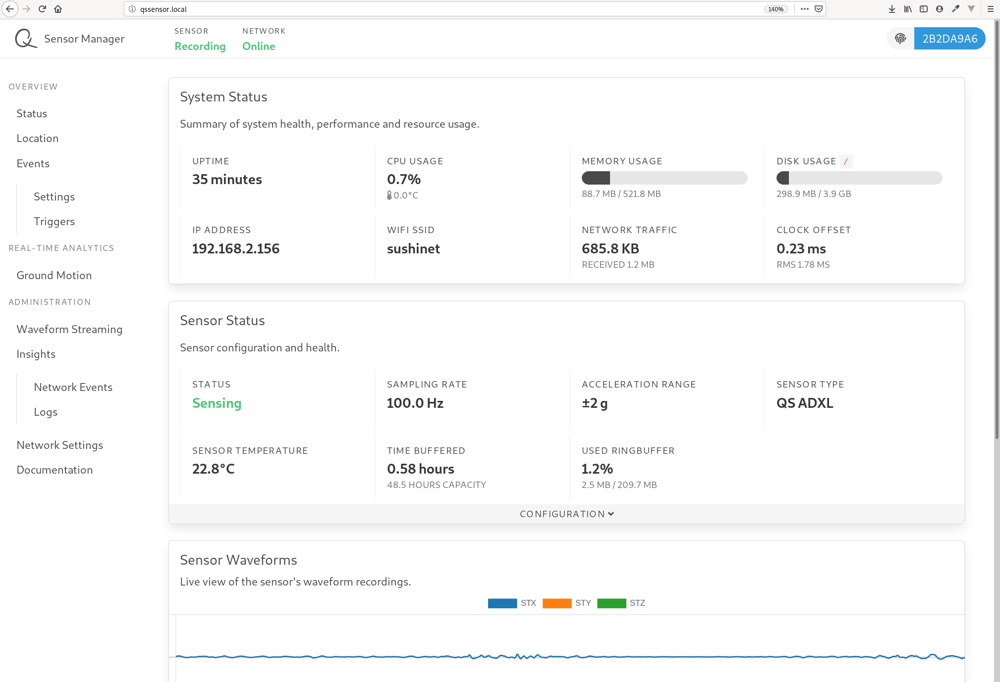
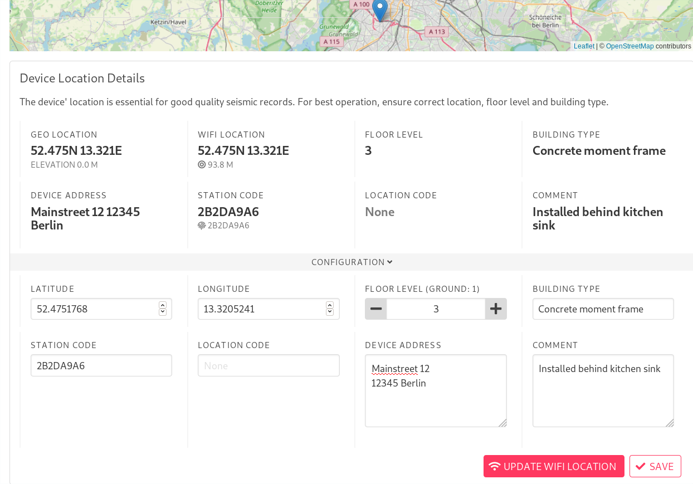
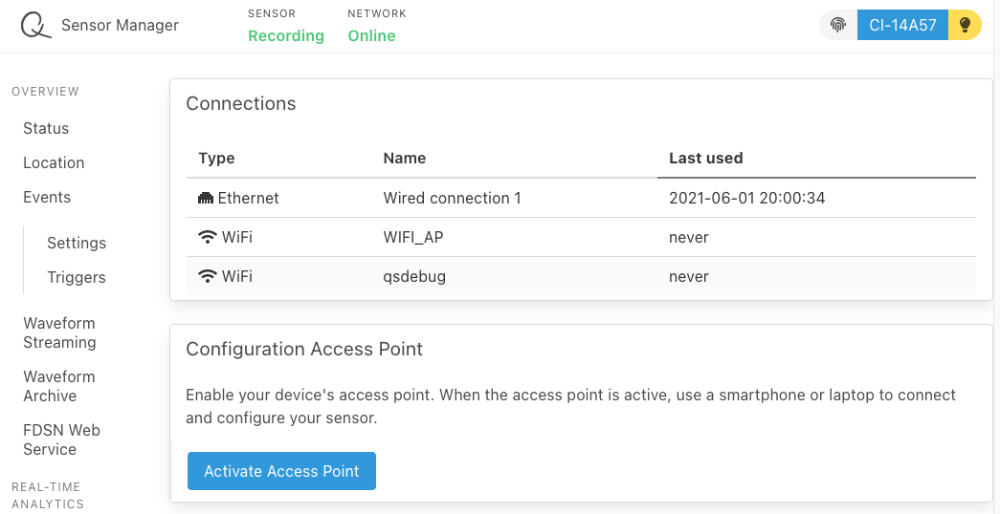
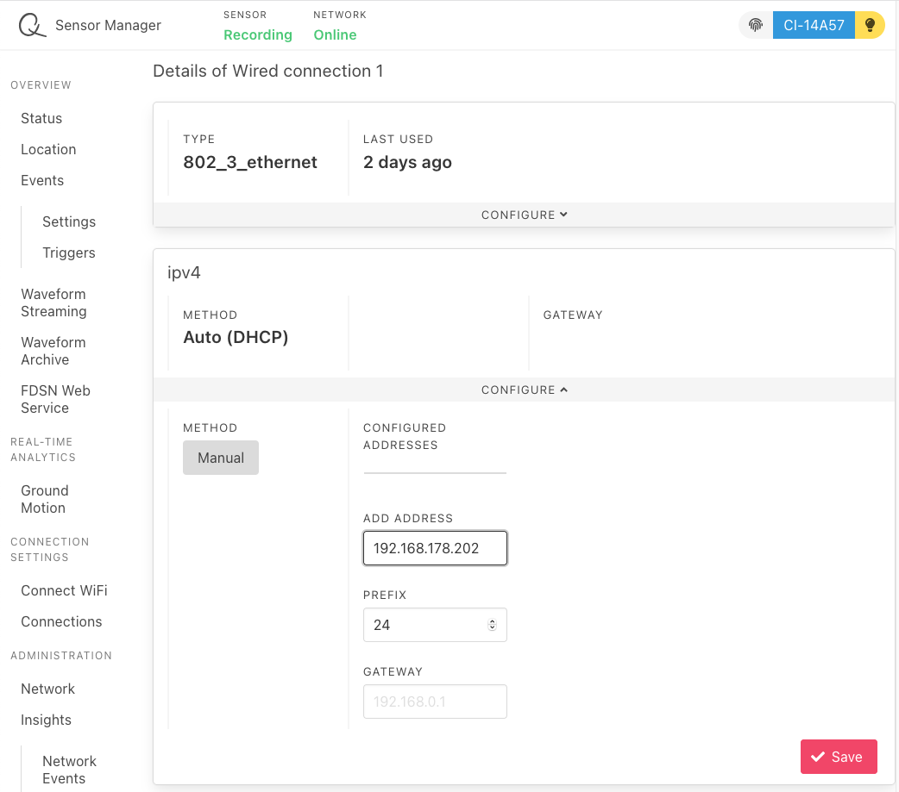

# Sensor Configuration

## System Overview

The local device configuration can be accessed from a device in the **same network** (LAN) using a web browser. Open the url [http://qssensor.local](http://qssensor.local).

::: warning Cannot find http://qssensor.local?
Your device will be accessible using a computer at [http://qssensor.local](http://qssensor.local) only if your router allows [mDNS broadcasting](https://en.wikipedia.org/wiki/Multicast_DNS). If mDNS broadcasting is disabled, you need to log into your router or use a tool such as [nmap](https://nmap.org/) to find the local IP address of your sensor.
:::

You should now see the local sensor configuration page providing you with a basic system overview.

::: tip
Each configurable panel has a _CONFIGURATION_ bar. You can click that bar to unfold a configuration menu.
:::

## Location settings

Open the *Location* tab.

The sensor can set a first estimated location based on nearby Wi-Fi ssids. Unfold the _CONFIGURATION_ menu and click the _UPDATE WIFI LOCATION_ button. Fine tune the location either by dragging and dropping the location pin on the map or by setting the exact location in the menu. Additional meta information such as address, floor level and building type will be helpful for later data analysis. You can also find the _STATION CODE_ in this panel which can be used to e.g. retrieve waveform data from your device.

## Event Triggers

Find the _Events_ menu, open the _Triggers_ settings and unfold the _CONFIGURATION_ menu. Set a threshold when your device should trigger and run its analysis plugins.

You can enable, disable and configure waveform analysis plugins under _Settings_. The results of each plugin are grouped into an event report which will be transmitted to the backend and made available for download and further offline processing.

## System Reboot

If you want to reboot your sensor open the _INSIGHTS_ panel and hit the _REBOOT_ button.

## Backend Connection

Your **token** is a secret alphanumeric string, used to associate and connect your devices to your user account on the back end. To see your token log into your account at [dev.quakesaver.net](https://dev.quakesaver.net) and go to `Account`.

Go to _Network Settings_ and open the _CONFIGURATION_ panel. Paste your personal [QuakeSaver TOKEN](./#quakesavertoken) into the designated field and click on _SAVE_. Your sensor will now be assigned to your personal sensor collection.

## Network Interfaces

Ethernet and Wi-Fi are by default configured as DHCP clients. If
a static IP address is required, go to _Connections_.

Click on the connection that you would like to configure. In this example this is *Wired connection 1* which is the ethernet interface.

Unfold the **CONFIGURE** panel.
In the **Method** field select **MANUAL**. Enter the IP address (and gateway [optional]) and click **Save**.

::: warning Work in Progress
Note, that there is no fallback mechanism implemented, yet. Thus, connectivity might be lost if network interfaces are misconfigured.

Also, the setting update needs some time before it is reflected by the UI. Thus, double-check the updated settings in your router.  

We're working on it :construction:
:::
