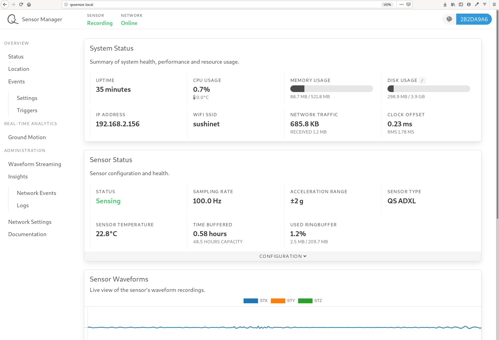
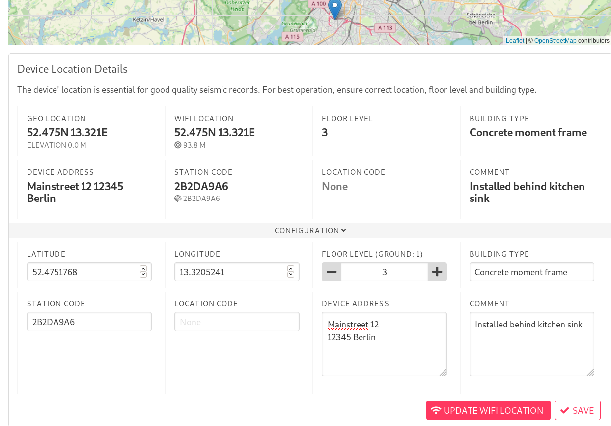
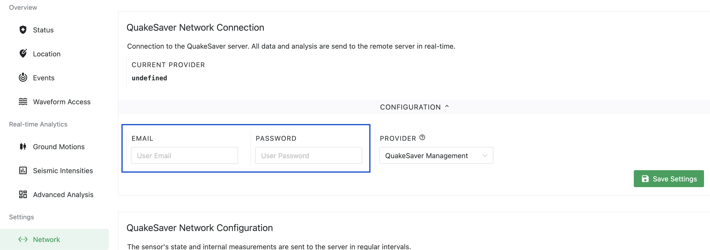

# Sensor Configuration

## System Overview

The local device configuration can be accessed from a device in the **same network** (LAN) using a web browser. Open the url [http://qssensor.local](http://qssensor.local).

::: warning Cannot find <http://qssensor.local>?
Your device will be accessible using a computer at [http://qssensor.local](http://qssensor.local) only if your router allows [mDNS broadcasting](https://en.wikipedia.org/wiki/Multicast_DNS). If mDNS broadcasting is disabled, you need to log into your router or use a tool such as [nmap](https://nmap.org/) to find the local IP address of your sensor.
:::

You should now see the local sensor configuration page providing you with a basic system overview.

::: tip
Each configurable panel has a _CONFIGURATION_ bar. You can click that bar to unfold a configuration menu.
:::

## Location settings

Open the _Location_ tab.

Unfold the _CONFIGURATION_ menu and set the location either by dragging and dropping the location pin on the map or by setting the exact location in the menu. Additional meta information such as address, floor level and building type will be helpful for later data analysis. You can also find the _STATION CODE_ in this panel which can be used to e.g. retrieve waveform data from your device.

## Event Triggers

Find the _Events_ menu, open the _Triggers_ settings and unfold the _CONFIGURATION_ menu. Set a threshold when your device should trigger and run its analysis plugins.

You can enable, disable and configure waveform analysis plugins under _Settings_. The results of each plugin are grouped into an event report which will be transmitted to the backend and made available for download and further offline processing.

## System Reboot

If you want to reboot your sensor open the _INSIGHTS_ panel and hit the _REBOOT_ button.

## Backend Connection

The sensor connects to the SeismiQ backend using **your account credentials** — the same email address and password you use to log in at [network.quakesaver.net](https://network.quakesaver.net). A separate access token is no longer required.

Open the _Network_ settings and unfold the _CONFIGURATION_ menu of the _QuakeSaver Network Connection_ panel. Enter your **email** and **password** in the fields highlighted by the blue rectangle, leave the _PROVIDER_ set to _QuakeSaver Management_, and click _Save Settings_.

The sensor will now authenticate against the backend and be assigned to your personal sensor collection.
