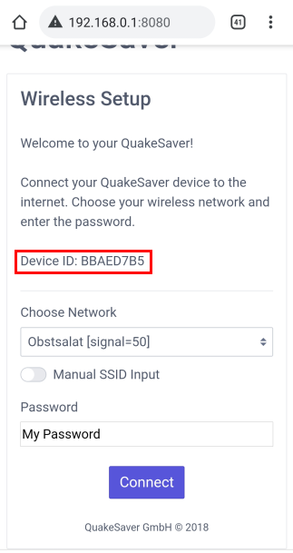

# Quick-start Guide

::: tip
To associate a QuakeSaver sensor to your user account it will be helpful to have your [QuakeSaver token](./configuration.md#backend-connection) already at hand.
:::

## Connecting Wi-Fi

If the sensor cannot establish a connection to a known WiFi within 30 second, your **sensor will open a Wi-Fi access point named _QS-setup [DEVICE_ID]_**.

Take a Wi-Fi enabled computer or smartphone and connect to that Wi-Fi access point.

::: warning Your smartphone/computer disconnects automatically from the setup access point?
Note that the Wi-Fi access point does not provide an internet connection.
Your end user device may complain about that. E.g. Android 10 will inform the user that no internet connection could be established. You have to explicitly confirm that you want to stay connected.
:::

Open a browser and go to [http://qssensor.local:8080](http://qssensor.local:8080) **or** [http://192.168.0.1:8080](http://192.168.0.1:8080) **if you are using a smartphone or tablet to connect**.

::: tip
To identify your sensor later it will be useful to **take note of the Device ID** (red box).
:::

Select a Wi-Fi from the drop-down menu, enter the password and click the _connect_ button. The Wi-Fi access point will turn off, and the sensor will attempt to establish a connection to that selected access point.

## Connecting Ethernet

Alternatively, you can connect your sensor using an Ethernet cable. Simply plug the Ethernet cable in the designated receptacle.
